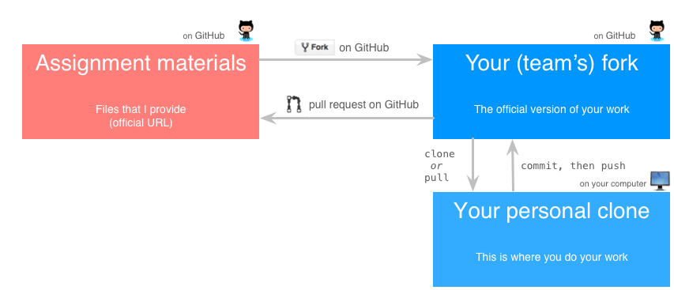

We'll use GitHub as a submission and critique system. Here's a diagram of the
process (click to view in a separate window):

<a class="image-link" href="images/git_workflow.png" target="_">
      
</a>

**Note:** These instructions will describe two ways of interacting with GitHub: 

   1. Using Sourcetree, an application that makes it easy to work with GitHub.
      This is the preferred way to do things. See the 
      [Installing Sourcetree](Installing-SourceTree.html) page for information on 
      how to set up Sourcetree on your computer.
   1. Using the command line. If you want to go this route, I'll assume you
      already know what you're doing! :)

<a name="get-materials"></a>
## Get the assignment materials by forking the official repository
<a href="images/fork.gif" target="_">(click for a GIF demo)</a>

1. Go to the assignment's page on GitHub (we'll call this `<official-url>`).
1. At the top right of the page, click the Fork button to fork the repository to your account.

We'll call the fork that lives on GitHub the _GitHub fork_. Think of it as the
official version of _your_ work. If it's not on your GitHub account, it's not
official!


<a name="clone-fork"></a>
## Clone your fork to your own machine
<a href="images/clone.gif" target="_">(click for a GIF demo)</a>

You'll probably want to edit files on your own computer, rather than on GitHub.
So, you'll need to get the files from GitHub to your computer.

   1. On your fork's GitHub page, click the `Clone or download button`. 
   1. Click the text that says `Use HTTPS`.
   1. Click `Open in Desktop`. Sourcetree should open a `Clone New` dialog box
      with some information filled out.
   1. In `Destination Path`, select the directory on your computer where you'd
      like your files to live. You may need to create a new directory. We'll
      call this directory the _local clone_.
   1. Click the `Clone` button.
   1. Sourcetree opens a new window with information about your local clone.


### Using the command line, instead
On your own machine, in a directory that will contain your assignment, run:
```
git clone <fork-url>
```


<a name="connect-local"></a>
## Connect your local clone back to the official repository 
This step lets you get updates to the original assignment, if necessary. 
 
   1. In the Sourcetree window for your local clone, on the left-hand side of
      the window, right-click `REMOTES`.
   1. Select `New Remote...`. 
   1. In the pop-up box:
      1. For `Remote name`, use `upstream`.
      1. For `URL / path`, use the `<official-url>`.
      1. Click `OK`.
   1. Click `OK` again.

### Using the command line, instead
In your local clone directory, run:
```
git remote add upstream <official-url>
```


<a name="commit-fork"></a>
## Work on the assignment and commit back to the GitHub fork
<a href="images/work-commit-push.gif" target="_">(click for a GIF demo)</a>

Use your favorite text / code editor to work on your assignment. 

While you're working, **be sure to commit often**. Each time you do a reasonable
piece of work (e.g,. answer a question or implement a small feature), perform a 
commit, like so:

   1. In the Sourcetree window for your local clone, on the left-hand side, 
      under `WORKSPACE`, click `File status`. 
   1. You should see all the changes you've made your files.
   1. Check the box next to the files that you want to commit.
   1. At the bottom of the screen, click in the `Commit message` box.
   1. Write a commit message: a short, informative description of the change.
   1. Under the commit-message box, check the box that says 
      `Push changes immediately to...`.
   1. Click the `Commit` button. 
   
      **Note:** The first time you do this, you
      will probably need to enter your GitHub credentials. If your computer
      gives you an option to save your login information, you might want to, so
      that you don't have to enter your GitHub username and password every 
      time you commit/push.
      {: .notice--info}

Your changes are now saved on GitHub.

### Using the command line, instead
This command will commit your changes to the local clone:
```
git commit -m 'an informative log message'
```

If you add a new file, you'll need to add it to the repository:
```
git add <new file>
```

Eventually, you'll need to push the changes from your local clone to your fork 
on GitHub:
```
git push
```


<a name="update-team"></a>
## (Possibly) get updates from your teammate(s)  
The version of your work that's on Github might be different from the version in
your local clone—for example, if you're working on a team and your teammate
pushes code to Github. In this case, you'll want to always get the latest
version of the work from Github before you modify your code. Here's how:

   1. In the Sourcetree window for your local clone, at the top of the window,
      click the `Pull` button.


### Using the command line, instead
To get updates from the GitHub fork to your local clone, run:
```
git pull
```


<a name="update-official"></a>
## (Possibly) get changes to the official assignment  
If the assignment changes after it comes out, you can get updates like so:

   1. First, make sure that your local clone is up-to-date with your fork on
      GitHub (by committing / pushing any changes).
   1. In the Sourcetree window for your local clone, on the left-hand side of
      the window, under `REMOTES`, right-click on `upstream`. Select 
      `Pull from upstream...`.
   1. For `Remote branch to pull`, select `master`. 
   1. Click `OK`.

Your files should now contain updates from me.

### Using the command line, instead
In your local clone directory, run:
```
git pull upstream master
```

You'll then need to commit and push back to your GitHub fork.


<a name="turn-in"></a>
## Turn in your assignment by submitting a pull request
<a href="images/pull-request.gif" target="_">(click for a GIF demo)</a>

1. On GitHub, go to the page for *your* repository.
1. Click on the Pull Request button (it's the green button with two arrows, 
   right above the list of repository files).
1. *Important*: Make sure you're submitting _from_ the correct repository _to_ 
   the correct repository.
  1. On the left-hand side, make sure it's the master for the assignment's 
     repository.
  1. On the right-hand side, make sure it's the master for your fork.
  1. Click "Create pull request".
  1. Use your name(s) for the title of the pull request.

You can keep updating your fork after you submit a pull request. All future 
updates to your GitHub repository (e.g., via pushes) will be tracked by the pull
request.


<a name="peer-review"></a>
## Peer-review other people's work
Each assignment will have a portion devoted to critique. I'll suggest some
prompts that you can use to help you give good feedback to other people. To give
feedback, comment on other people's pull requests.
